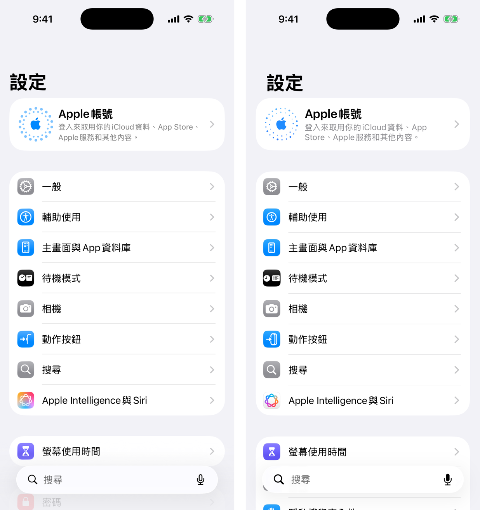
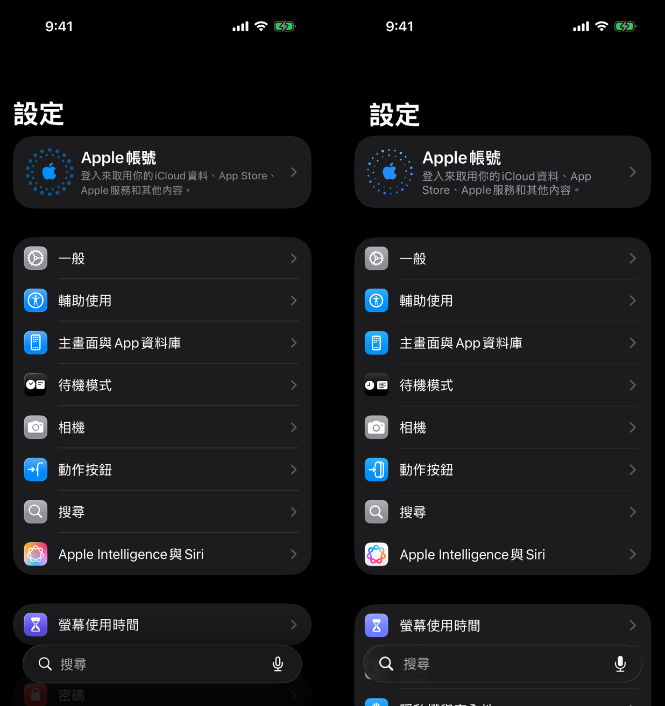

# SettingsClone

用 SwiftUI 模仿 iOS 26「設定」App 首頁的一頁靜態畫面（彼得潘 iOS App 作業）。

| 原始畫面 vs 模仿畫面（一般模式） | 原始畫面 vs 模仿畫面（Dark mode） |
|---|---|
|  |  |

## 使用到的技術
- `VStack`、`HStack`、`ZStack`、`Text`、`Image`、`ScrollView`
- 圖片：Asset（Apple 帳號的圓點圖示）＋ SF Symbol（所有設定圖示）
- 多個檔案定義 view：`SettingsView`、`AccountCard`、`SettingsSection`、`SettingsRow`、`SettingIcon`、`SearchBar`
- 用 property 客製 view：`SettingsRow(item:)`、`SettingIcon(symbol:color:)`、`AccountCard(title:subtitle:)`
- 加分：一般模式＋Dark mode、`Text` 搭配 Markdown 連結、iOS 26 Liquid Glass 搜尋列

## 執行
Xcode 26，iOS 26 模擬器（iPhone 17 Pro）。打開 `SettingsClone.xcodeproj` 按 Run。
